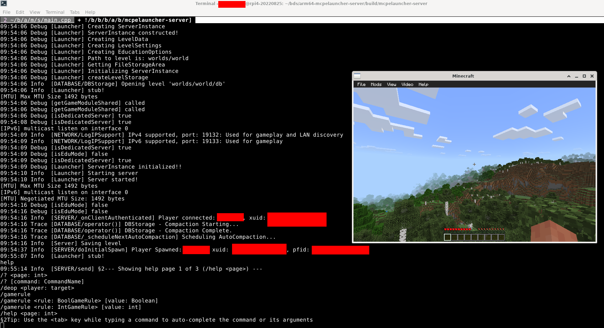

# arm64-mcpelauncher-server

An unstable hacky Minecraft Bedrock Edition server that runs on arm64 devices (e.g. Raspberry Pi)

This launcher only supports Minecraft v1.20.81 at this point, and the configuration files might not actually work :(
but still better than QEMU bc QEMU is slow af :/

Support for latest version is to be done later



The image above shows a Minecraft server running on Raspberry Pi 4 device smoothly 
(Only terminal window ssh'd to raspi, the Minecraft window is on my `x86_64` machine)

This project is based on [mcpelauncher](https://github.com/minecraft-linux/mcpelauncher-manifest) project.  
Some ideas of the class structures came from [LeviLamina](https://github.com/LiteLDev/LeviLamina).

Build instruction:
```
mkdir -p build
cd build
CC=clang CXX=clang++ cmake ..
make -j12
cp server.properties build/mcpelauncher-server/
mkdir build/mcpelauncher-server/data # or preferred data path
# the server should be at build/mcpelauncher-server
# download arm64-v8a version of .apk file on mcpelauncher ui settings-versions-download apk
# need to unpack game to build/mcpelauncher-server/game (or customized path) before use, the directory should contain 'lib/' and 'assets/'
```
