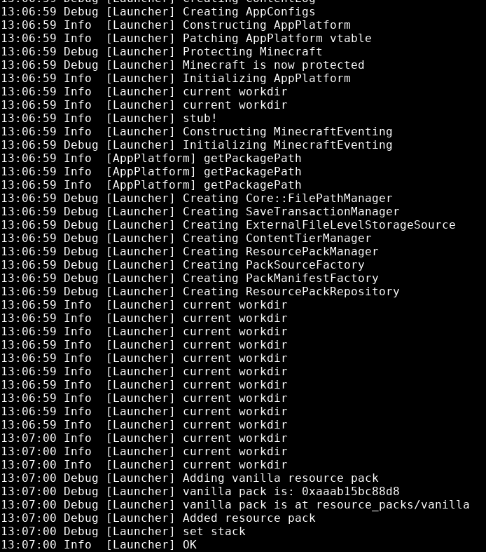

# arm64-mcpelauncher-server

An unstable hacky Minecraft Bedrock Edition server that runs on arm64 devices (e.g. Raspberry Pi)

**THIS BRANCH IS A WORK IN PROGRESS**

NOTE: This branch is for Minecraft **v1.21.101.01** (latest version as of August 29<sup>th</sup>, 2025),  
for Minecraft v1.21.60.28, [click here](https://github.com/LNSSPsd/arm64-mcpelauncher-server/tree/minecraft-v1.21.60.28).
for Minecraft v1.21.2.02, [click here](https://github.com/LNSSPsd/arm64-mcpelauncher-server/tree/minecraft-v1.21.2.02).
for Minecraft v1.20.81, [click here](https://github.com/LNSSPsd/arm64-mcpelauncher-server/tree/minecraft-v1.20.81.01).



Current progress: Up until resource pack loading.

This project is based on [mcpelauncher](https://github.com/minecraft-linux/mcpelauncher-manifest) project.  
Some ideas of the class structures came from [LeviLamina](https://github.com/LiteLDev/LeviLamina).

Build instruction:
```
mkdir -p build
cd build
CC=clang CXX=clang++ cmake ..
make -j12
cp server.properties build/mcpelauncher-server/
mkdir build/mcpelauncher-server/data # or preferred data path
# the server should be at build/mcpelauncher-server
# download arm64-v8a version of .apk file on mcpelauncher ui settings-versions-download apk
# and unpack game to build/mcpelauncher-server/game (or customized path) before use, the directory should contain 'lib/' and 'assets/'
```
